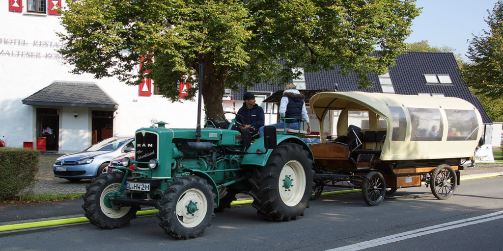
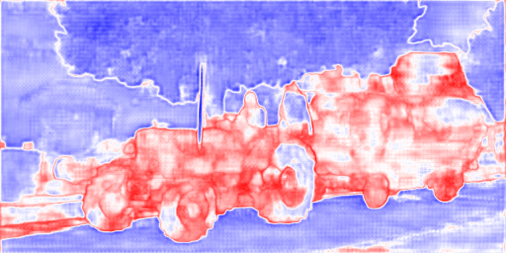

# Real-Time-Anomaly-Segmentation for Road Scenes
This repository contains the code for the __Real-Time Anomaly Segmentation for Road Scenes__ project, developed as part of the Advanced Machine Learning course at the Polytechnic University of Turin. 
This repository is associated with the corresponding paper [s303369_s300269_s314589_project6.pdf](s303369_s300269_s314589_project6.pdf).

### Visualization of result
Below is an example of anomaly segmentation using the ERFNet model with the Max Logit inference method.

  

  

  

The top row contains the original images, the middle row represents the ground truth anomalies, and the bottom row visualizes the estimated anomaly scores,  where deeper shades of red indicate higher anomaly levels.

## Packages
For instructions, please refer to the README in each folder:

* [train](train) contains tools for training the network for semantic segmentation.
* [eval](eval) contains tools for evaluating/visualizing the network's output and performing anomaly segmentation.
* [imagenet](imagenet) Contains script and model for pretraining ERFNet's encoder in Imagenet.
* [trained_models](trained_models) Contains the trained models used in the papers. 
* [save](save) Contains the models trained for our experiments. 

## Requirements:

* [**The Cityscapes dataset**](https://www.cityscapes-dataset.com/): Download the "leftImg8bit" for the RGB images and the "gtFine" for the labels. **Please note that for training you should use the "_labelTrainIds" and not the "_labelIds", you can download the [cityscapes scripts](https://github.com/mcordts/cityscapesScripts) and use the [conversor](https://github.com/mcordts/cityscapesScripts/blob/master/cityscapesscripts/preparation/createTrainIdLabelImgs.py) to generate trainIds from labelIds**
* [**Python 3.6**](https://www.python.org/): If you don't have Python3.6 in your system, I recommend installing it with [Anaconda](https://www.anaconda.com/download/#linux)
* [**PyTorch**](http://pytorch.org/): Make sure to install the Pytorch version for Python 3.6 with CUDA support (code only tested for CUDA 8.0). 
* **Additional Python packages**: numpy, matplotlib, Pillow, torchvision and visdom (optional for --visualize flag)
* **For testing the anomaly segmentation model**: Road Anomaly, Road Obstacle, and Fishyscapes dataset. All testing images are provided here [Link](https://drive.google.com/file/d/1r2eFANvSlcUjxcerjC8l6dRa0slowMpx/view).

## Notebook
For running the evaluation, you can use `Real_Time_Anomaly_Segmentation_for_Road_Scenes.ipynb` which contains some useful commands.

## Segmentantion models:
The repo provides the following pre-trained networks on the cityscapes dataset that can be used to perform anomaly segmentation on test anomaly datasets:
* __ERFNet__ 
* __BiSeNetV2__ 
* __Enet__ 
